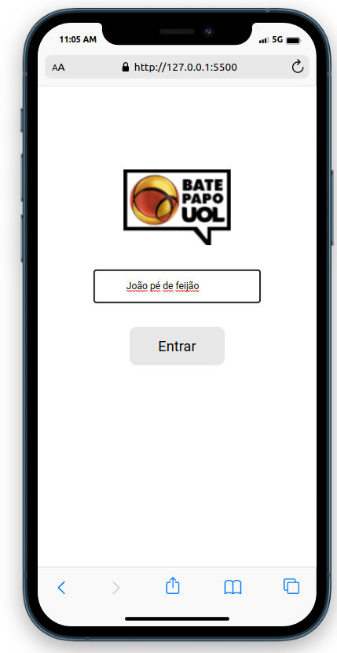
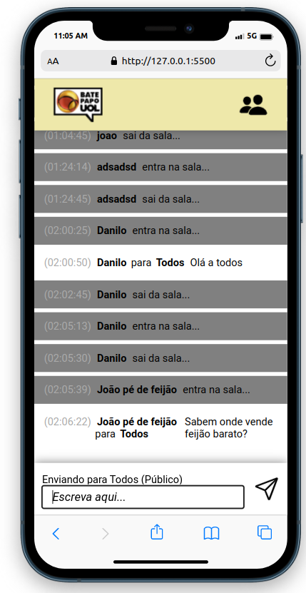
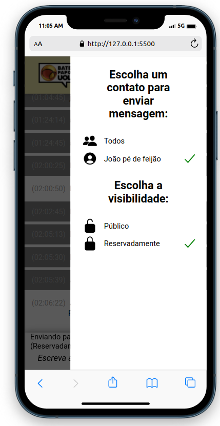
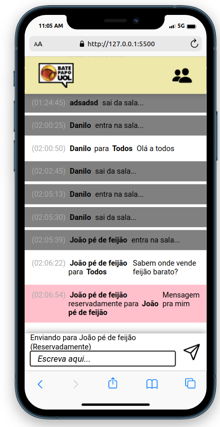

<h1 align="center">Bate Papo UOL</h1>

  
  
  
  

  

<!--  -->

<h2> :gear: Tecnologias utilizadas</h2>

  
  
  
  

 

<h2>:information_source: Descrição</h2>

  Projeto realizado durante o bootcamp Driven para treinar minhas habilidades nas tecnologias utilizadas.
   
  Trata-se de um protótipo do front de um aplicativo de mensagens, simulando o saudoso bate papo UOL. Podemos entrar com o nosso nome e ter acesso
  ao histórico de mensagens trocadas publicamente entre os usuários. Além disso, ao escolher a opção para mandar a mensagem reservadamente, apenas
  o destinatário tem acesso à mensagem. Há, ainda, uma barra lateral onde se localizam os usuários ativos. Esses são desativados caso saiam do
  aplicativo.
   
  Nesse projeto, a API já estava desenvolvida, bastando realizar as requisições. Posteriormente, desenvolvi a API para esse aplicativo, a qual pode ser
  encontrada aqui:
  <a href="https://github.com/DaniloLO53/projeto13-batepapo-uol-api">Bate Papo UOL - API</a>
   
  <strong>Para rodar a aplicação localmente:</strong>

<ol>
   <li>Clone o repositório na sua máquina;</li>
   <li>Abra a pasta do código, de preferência utilizando o VS Code;</li>
   <li>Inicie a aplicação através do Live Server.</li>
</ol>

 

<h2>
   :rage1: Principais desafios
</h2>
<ul>
  <h3>:heavy_check_mark: Softskills</h3>
  <li>
    <strong>Gestão do tempo</strong>: Esse projeto levou cerca de 20,5 horas para ser concluído. O maior desafio foi conciliar as aulas
    do curso com a realização das tarefas.
  </li>
  <li>
    <strong>Estratégia de rotina:</strong> Conforme as dificuldades ao longo do código apareciam, tornava-se tentador não realizar pausas
    estratégicas para descanso, já que o foco estava em terminar as tarefas. Aprendi a alternar ao longo do dia entre momentos produtivos
    e de relaxamento.
  </li>
  
  <h3>:heavy_check_mark: Hardskills</h3>
  <li>
    <strong>Quantidade de features</strong>: Por se tratar de um projeto maior do que os que eu já estava acostumado a realizar, foi um desafio desenvolver
    todos os requerimentos.
  </li>
  <li>
    <strong>Mensagem privada</strong>: Como o filtro de mensagens privadas é feita através do front, foi um desafio mostrar a mensagem para o destinatário
    correto.
  </li>
  <li>
    <strong>Barra lateral</strong>: Foi o primeiro projeto em que eu implementei uma barra lateral de fato. Além do CSS, o outro desafio foi renderizar
    os usuários conforme estavam ativos ou não.
  </li>
</ul>

<h2>:blush: Entre em contato</h2>

[![LinkedIn][linkedin-shield]][linkedin-url]

[linkedin-shield]: https://img.shields.io/badge/-LinkedIn-black.svg?style=for-the-badge&logo=linkedin&colorB=blue
[linkedin-url]: https://www.linkedin.com/in/danilo-leao-dev/
