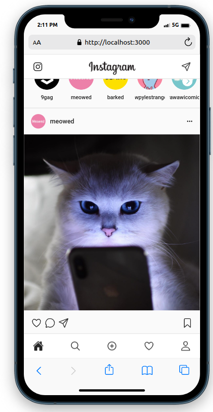
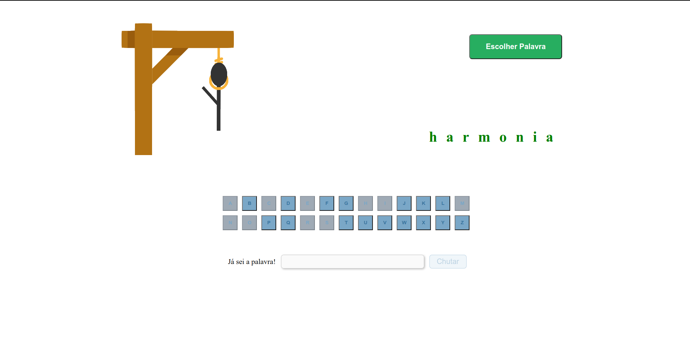

<h1 align="center">Jogo da Forca</h1>

  
  

  

<!--  -->

<h2> :gear: Tecnologias utilizadas</h2>

  
  
  

 

<h2>:information_source: Descrição</h2>

  Projeto realizado durante o bootcamp Driven para treinar minhas habilidades nas tecnologias utilizadas.
   
  Trata-se do conhecido Jogo da Forca, no qual o usuário deverá escolher uma letra ou uma palavra inteira. Caso o chute da palavra esteja errado, o         jogador perde. Ainda, caso o jogador escolha 6 letras que não pertencem à palavra, o jogador também perde.
   
  Existe a opção de reiniciar o jogo, trocando a palavra a ser descoberta.
   
  <strong>Para rodar a aplicação localmente:</strong>

<ol>
   <li>Clone o repositório na sua máquina;</li>
   <li>Na raíz do projeto, execute o comando <code>npm i</code> para instalar as dependências;</li>
   <li>Rode o comando <code>npm start</code> para rodar a aplicação na porta 3000;</li>
</ol>

 

<h2>
   :rage1: Principais desafios
</h2>
<ul>
  <h3>:heavy_check_mark: Softskills</h3>
  <li>
    <strong>Gestão do tempo</strong>: Esse projeto levou cerca de 28 horas para ser concluído. O maior desafio foi conciliar as aulas
    do curso com a realização das tarefas.
  </li>
  <li>
    <strong>Organização de cronograma</strong>: Como tive muita dificuldade com a lógica desse projeto, foi difícil organizar uma rotina semanal e não       cair na tentação de não realizar pausas. A falta de descanso e, também, ter demorado a pedir ajuda nesse projeto em particular foi um dos principais     fatores para o longo tempo de projeto.
  </li>
  
  <h3>:heavy_check_mark: Hardskills</h3>
  <li>
    <strong>Mudança de estilo de programação</strong>: Foi o primeiro projeto em que componentizei os elementos da aplicação. Foi um desafio entender o 
    que deveria ser componentizado ou não.
  </li>
  <li>
    <strong>Lógica do jogo</strong>: O maior desafio técnico foi lidar com os diferentes estados do jogo. O conceito de reatividade foi amplamente
    aplicado nesse projeto.
  </li>
</ul>

<h2>:blush: Entre em contato</h2>

[![LinkedIn][linkedin-shield]][linkedin-url]

[linkedin-shield]: https://img.shields.io/badge/-LinkedIn-black.svg?style=for-the-badge&logo=linkedin&colorB=blue
[linkedin-url]: https://www.linkedin.com/in/danilo-leao-dev/
