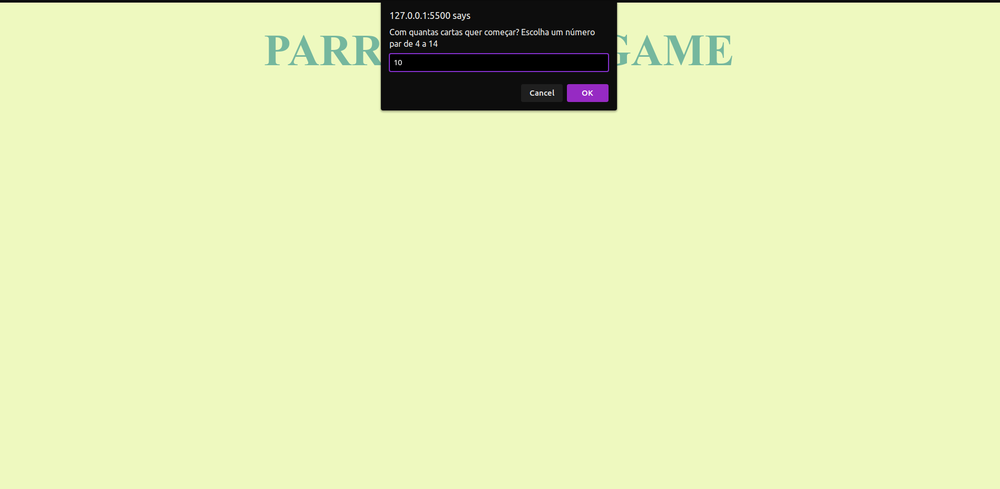
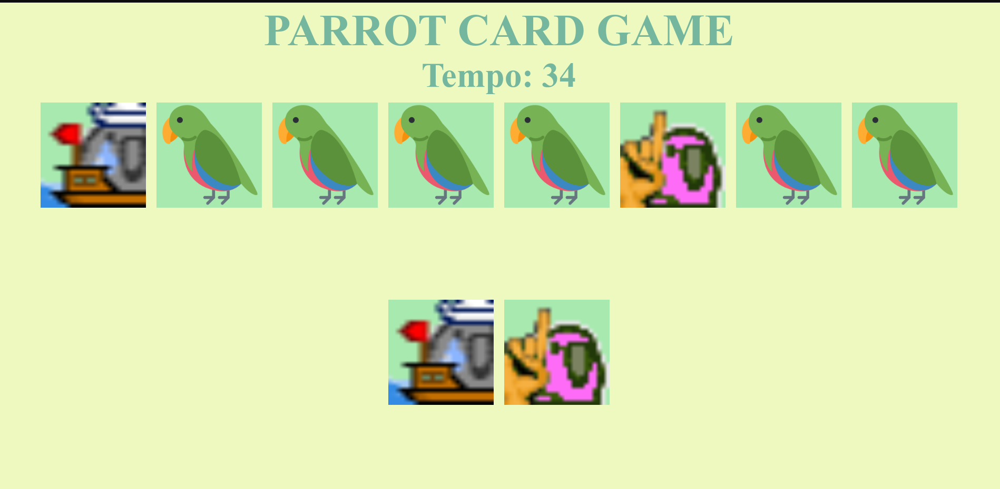
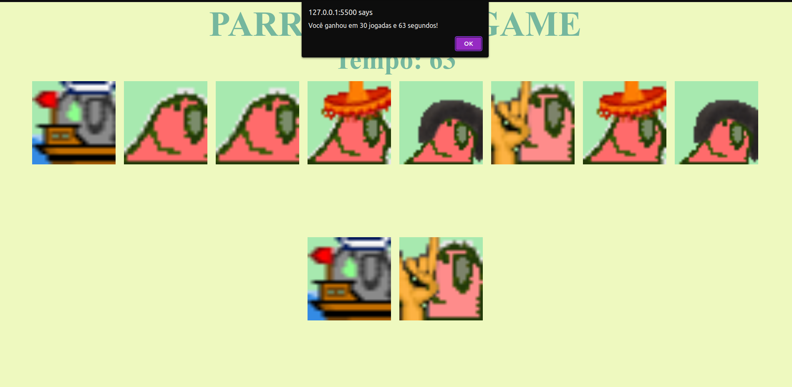

<h1 align="center">Parrot Card Game</h1>

  
  
  

  

<!--  -->

<h2> :gear: Tecnologias utilizadas</h2>

  
  
  

 

<h2>:information_source: Descrição</h2>

  Projeto realizado durante o bootcamp Driven para treinar minhas habilidades nas tecnologias utilizadas.
   
  Esse é um simples jogo de memorização. O jogador pode iniciar com um número par entre 4 e 14. Para cada duas cartas escolhidas, elas podem ter o mesmo   papagaio ou não. Se eles forem diferentes, as duas cartas são viradas de volta. Caso contrário, elas permanecem viradas com o papagaio virado para       frente.
   
  Depois que todas as cartas forem viradas, o jogador pode reiniciar o jogo.
   
  <strong>Para rodar a aplicação localmente:</strong>

<ol>
   <li>Clone o repositório na sua máquina;</li>
   <li>Abra a pasta do código, de preferência utilizando o VS Code;</li>
   <li>Inicie a aplicação através do Live Server.</li>
</ol>

 

<h2>
   :rage1: Principais desafios
</h2>
<ul>
  <h3>:heavy_check_mark: Softskills</h3>
  <li>
    <strong>Gestão do tempo</strong>: Esse projeto levou cerca de 11 horas para ser concluído. O maior desafio foi conciliar as aulas
    do curso com a realização das tarefas.
  </li>
  <li>
    <strong>Planejamento:</strong> A complexidade da lógica do jogo crescia conforme novos bugs apareciam. Devido a essas mudanças, o desafio foi
    adaptar o planejamento do projeto ao longo da semana.
  </li>
  
  <h3>:heavy_check_mark: Hardskills</h3>
  <li>
    <strong>Animações em CSS</strong>: A animação na virada da carta tornou-se um desafio, uma vez que o elemento a ser clicado mudava conforme sua
    posição. Tive que ter cuidado redobrado ao escolher qual elemento realmente deveria ser clicado (a parte da frente da carta, a parte de trás ou
    o container do elemento).
  </li>
  <li>
    <strong>Javascript imperativo</strong>: Por se tratar de um jogo, todo o código segue um padrão declarativo, já que a continuidade do jogo depende
    de estados anteriores. O desafio foi escrever o código de forma declarativa sem utilizar bibliotecas como React.
  </li>
</ul>

<h2>:blush: Entre em contato</h2>

[![LinkedIn][linkedin-shield]][linkedin-url]

[linkedin-shield]: https://img.shields.io/badge/-LinkedIn-black.svg?style=for-the-badge&logo=linkedin&colorB=blue
[linkedin-url]: https://www.linkedin.com/in/danilo-leao-dev/
