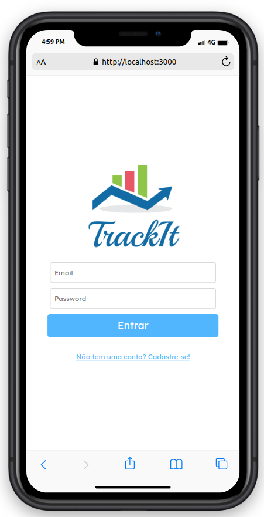
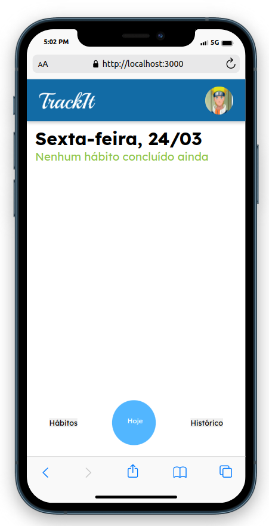

<h1 align="center">Trackit</h1>

  
  
  
  
  
  

  

<!--  -->

<h2> :gear: Tecnologias utilizadas</h2>

  
  
  
  
  

 

<h2>:information_source: Descrição</h2>

  Projeto realizado durante o bootcamp Driven para treinar minhas habilidades nas tecnologias utilizadas.
   
  Trata-se de um aplicativo para registrar hábitos semanais e diários.
   
  O propósito desse projeto foi estudar sobre os states do React utilizando a hook UseEffect, além de realizar requisições pelo axios para uma API já
  desenvolvida previamente. Além disso, fiz uso do Context API e utilizei pequenas libs como DayJS.
   
  <strong>Para rodar a aplicação localmente:</strong>

<ol>
   <li>Clone o repositório na sua máquina;</li>
   <li>Na raíz do projeto, execute o comando <code>npm i</code> para instalar as dependências;</li>
   <li>Rode o comando <code>npm start</code> para rodar a aplicação na porta 3000;</li>
</ol>

 

<h2>
   :rage1: Principais desafios
</h2>
<ul>
  <h3>:heavy_check_mark: Softskills</h3>
  <li>
    <strong>Gestão do tempo</strong>: Esse projeto levou cerca de 14 horas para ser concluído. Por ser um desafio mais complexo se comparados aos projeto     s anteriores, levei mais tempo para concluir.
  </li>
  
  <h3>:heavy_check_mark: Hardskills</h3>
  <li>
    <strong>Uso de Proptypes</strong>: Nesse projeto utilizei pela primeira vez o Context API para gerenciamento de estados. Apesar da complexidade           inicial na curva de aprendizagem, consegui entender bem os conceitos. 
  </li>
</ul>

<h2>:blush: Entre em contato</h2>

[![LinkedIn][linkedin-shield]][linkedin-url]

[linkedin-shield]: https://img.shields.io/badge/-LinkedIn-black.svg?style=for-the-badge&logo=linkedin&colorB=blue
[linkedin-url]: https://www.linkedin.com/in/danilo-leao-dev/
